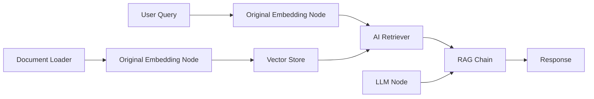

# 🚀 Original Embedding Node for n8n

[](https://badge.fury.io/js/%40original-land%2Fn8n-nodes-original-embedding)
[](https://opensource.org/licenses/MIT)

A powerful custom n8n node that allows you to generate embeddings using your own embedding server. Perfect for RAG (Retrieval-Augmented Generation) workflows, semantic search, and AI applications.

## 🌟 Features

- 🔧 **Custom Embedding Server**: Connect to any OpenAI-compatible embedding API
- 🔐 **Flexible Authentication**: Support for API Key, Basic Auth, or both combined  
- 🧠 **RAG Compatible**: Seamlessly integrates with n8n's AI ecosystem (Vector Stores, Retrievers, etc.)
- ⚡ **Batch Processing**: Optional batch processing for improved performance
- 🔄 **Standard Compliance**: Full compatibility with n8n's `ai_embedding` connection type
- 🛡️ **Secure**: Encrypted credential storage with multiple authentication methods

## 📦 Installation

### Option 1: npm Installation
```bash
npm install @original-land/n8n-nodes-original-embedding
```

### Option 2: Manual Installation
1. Download the latest release
2. Extract to your n8n custom nodes directory
3. Restart n8n

### Option 3: From Source
```bash
git clone https://github.com/noku-team/n8n-original-embedding.git
cd n8n-original-embedding
pnpm install
pnpm build
```

## ⚙️ Configuration

### 1. Setup Credentials

Create new **Embedding Server API** credentials with:

#### Authentication Methods:
- **API Key Only**: For servers requiring only API key authentication
- **Basic Auth Only**: For servers using username/password
- **API Key + Basic Auth**: For servers requiring both (recommended)

#### Fields:
- **Authentication Method**: Choose your server's auth requirements
- **API Key**: Your embedding server API key (if applicable)
- **Username**: Basic auth username (if applicable)  
- **Password**: Basic auth password (if applicable)

### 2. Node Configuration

- **Endpoint URL**: Your embedding server endpoint
  ```
  https://your-server.com/api/v1/openai-compatible/embeddings
  ```
- **Model**: The embedding model to use (e.g., `query`, `document`)
- **Input Text**: Text to embed (supports n8n expressions like `={{ $json.text }}`)
- **Batch Processing**: Enable for processing multiple texts efficiently

## 🔄 Usage Examples

### Basic Text Embedding
```json
Input: {
  "text": "This is a sample text to embed"
}

Output: {
  "text": "This is a sample text to embed",
  "embedding": [0.1, 0.2, -0.3, ...],
  "model": "your-model",
  "usage": { "prompt_tokens": 7, "total_tokens": 7 }
}
```

### RAG Workflow Integration



#### Example RAG Setup:
1. **Document Processing**:
   ```
   Document → Original Embedding Node → Vector Store (Pinecone/Weaviate)
   ```

2. **Query Processing**:
   ```
   User Query → Original Embedding Node → AI Retriever → RAG Chain → LLM → Response
   ```

### Advanced Configuration Example

```javascript
// Node parameters
{
  "endpoint": "https://api.yourserver.com/v1/embeddings",
  "model": "text-embedding-3-large", 
  "inputText": "={{ $json.content }}",
  "batchProcessing": true
}

// Credential configuration  
{
  "authMethod": "both",
  "apiKey": "your-secret-key",
  "username": "your-username", 
  "password": "your-password"
}
```

## 🔗 Compatibility

### Input Connections
- ✅ **Main nodes**: Any standard n8n node outputting data

### Output Connections  
- ✅ **AI Vector Stores**: Pinecone, Weaviate, Chroma, etc.
- ✅ **AI Retrievers**: For similarity search
- ✅ **AI Chains**: RAG chains, conversation chains
- ✅ **Other AI nodes**: Any node accepting `ai_embedding` type

### Supported n8n Versions
- n8n v1.0.0+
- Node.js 20.15+

## 🛠️ Development

### Prerequisites
- Node.js ≥ 20.15
- pnpm (recommended) or npm
- n8n development environment

### Setup
```bash
git clone https://github.com/noku-team/n8n-original-embedding.git
cd n8n-original-embedding
pnpm install
```

### Build
```bash
pnpm build
```

### Development Mode
```bash
pnpm dev
```

### Linting
```bash
pnpm lint          # Check for issues
pnpm lintfix       # Auto-fix issues
```

## 🔧 API Compatibility

Your embedding server should be OpenAI-compatible and support:

### Request Format
```json
POST /your-endpoint
{
  "input": "text to embed",
  "model": "your-model"
}
```

### Response Format  
```json
{
  "object": "list",
  "data": [{
    "object": "embedding", 
    "index": 0,
    "embedding": [0.1, 0.2, -0.3, ...]
  }],
  "model": "your-model",
  "usage": {
    "prompt_tokens": 5,
    "total_tokens": 5
  }
}
```

### Authentication Headers
The node automatically handles:
- `Authorization: your-api-key` (API Key mode)
- `Authorization: Basic base64(username:password)` (Basic Auth mode)  
- Both headers simultaneously (Combined mode)

## 🤝 Contributing

1. Fork the repository
2. Create your feature branch (`git checkout -b feature/amazing-feature`)
3. Commit your changes (`git commit -m 'Add amazing feature'`)
4. Push to the branch (`git push origin feature/amazing-feature`)
5. Open a Pull Request

## 📝 Changelog

See [CHANGELOG.md](CHANGELOG.md) for version history.

## 📄 License

This project is licensed under the MIT License - see the [LICENSE.md](LICENSE.md) file for details.

## 🆘 Support

- **Documentation**: [n8n Custom Nodes Guide](https://docs.n8n.io/integrations/creating-nodes/)
- **Issues**: [GitHub Issues](https://github.com/noku-team/n8n-original-embedding/issues)
- **Community**: [n8n Discord](https://discord.gg/n8n)

## 🏷️ Keywords

`n8n` `embedding` `ai` `rag` `vector-search` `custom-node` `openai` `machine-learning` `semantic-search`

---

Made with ❤️ by [Original.land](https://original.land)